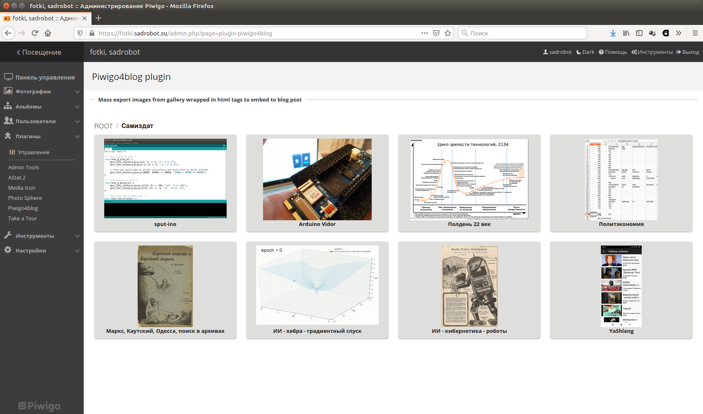
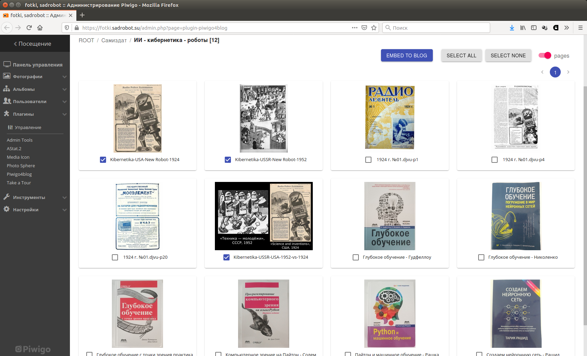
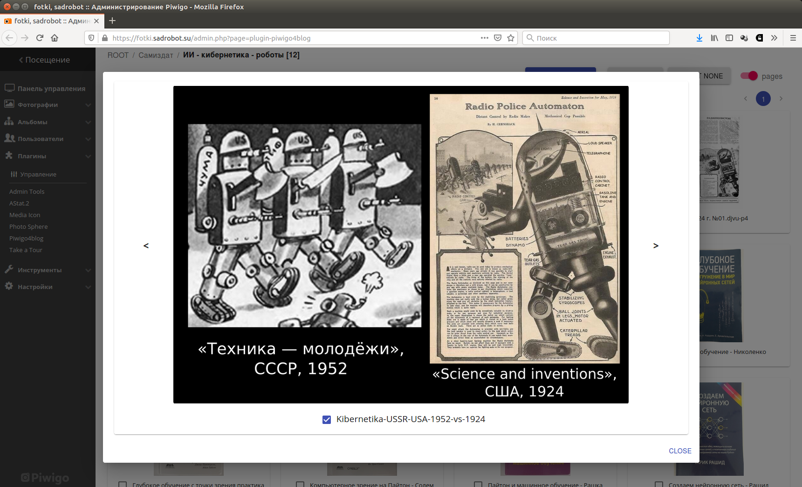
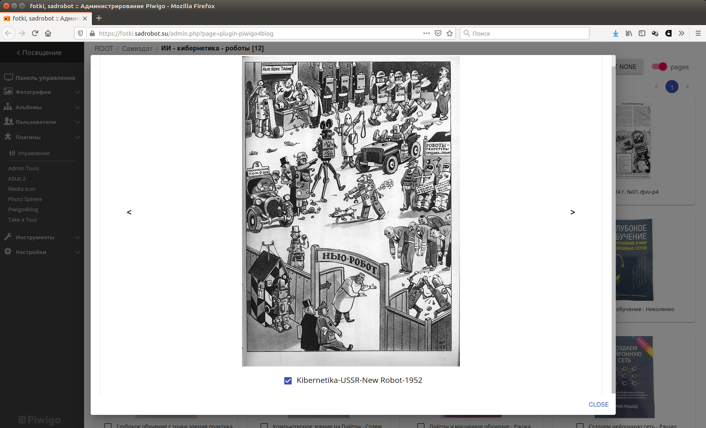
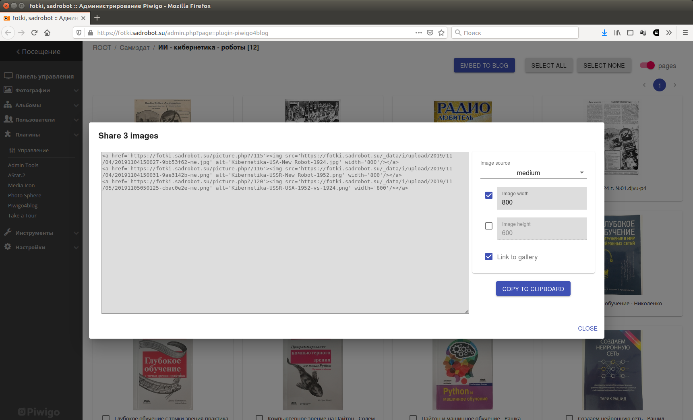
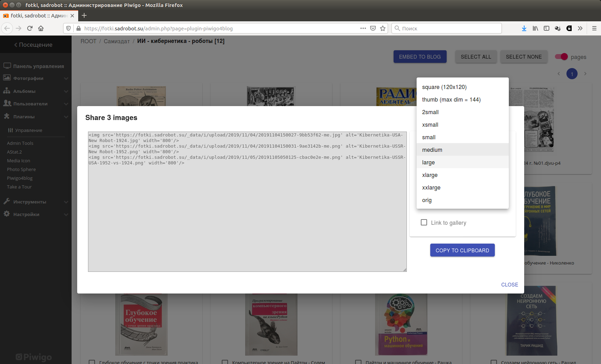
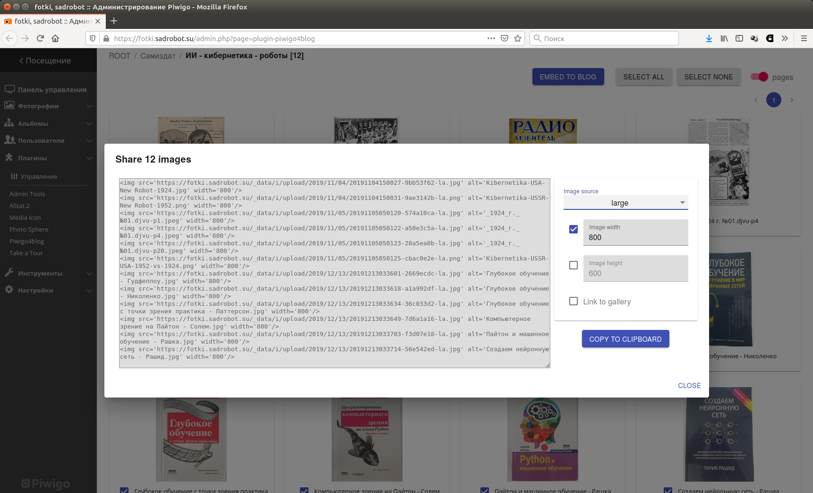

# piwigo4blog-react
Plugin for Piwigo self-hosted gallery: mass export images from gallery to embed to blog.

This project is client ui code with React. Server plugin and API: https://github.com/sadr0b0t/piwigo4blog

Install plugin to your Piwigo instance, go to Plugins > Piwigo4blog

Browse albums:

Select images in gallery mode:

or in slideshow mode:

Generate HTML code to embed selected images hosted on your Piwigo instance to some external blog:

# Install plugin

This project is client (browser) interface code.

For install instructions go to base plugin project
https://github.com/sadr0b0t/piwigo4blog

# Build client code

This project uses [NodeJS](https://nodejs.org) (as development toolchain), [ReactJS](https://reactjs.org/) and [Material-UI](https://material-ui.com/) components for React.

~~~
git clone https://github.com/sadr0b0t/piwigo4blog-react.git
cd piwigo4blog-react
npm install
npm run build
~~~

If no errors, new _build_ dir should appear like this: _piwigo4blog-react/build_.

Then go to _piwigo4blog-react/build/static/js_ and manually rename _main.xxx.js_ (where xxx would be some random string which would be new after each build) to main.js

Then copy _piwigo4blog-react/build/**static**_ dir to _piwigo4blog_ dir cloned from https://github.com/sadr0b0t/piwigo4blog

Now _piwigo4blog_ dir with its original contents and _static_ dir (like _piwigo4blog/static_) added here would be ready to install plugin.

